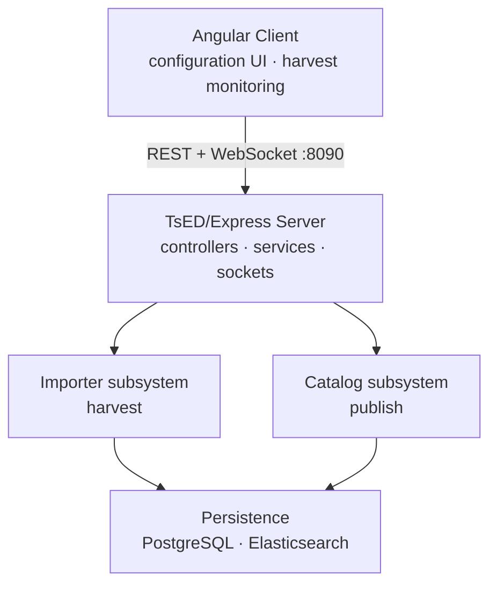

## Overview

Monorepo: Node.js/TypeScript server (TsED/Express), Angular web client, shared type library. The server harvests metadata from external sources → persists to PostgreSQL → publishes to target catalogs (Elasticsearch, CSW, Piveau). A profile factory (`ingrid` | `diplanung` | `lvr`) selected at startup determines available importer types, mappers, and catalog implementations.

---

## System Layers



---

## Module Boundaries

| Module | Path | Responsibility | Must NOT |
|--------|------|---------------|----------|
| Controllers | `server/app/controllers/` | HTTP endpoints, request/response mapping | Contain business logic; call persistence directly |
| Services | `server/app/services/` | Business logic, scheduling, config management | Depend on controllers |
| Importer | `server/app/importer/` | Fetch raw records, map to `IndexDocument`, write to PostgreSQL | Write directly to Elasticsearch or external catalogs |
| Catalog | `server/app/catalog/` | Publish records from PostgreSQL to target systems, delete stale records | Fetch from external sources; bypass the abstract `Catalog` base class |
| Profiles | `server/app/profiles/` | Configure importers, mappers, catalog implementations, ES index mappings per domain | Hard-code cross-profile assumptions |
| Persistence | `server/app/persistence/` | PostgreSQL and Elasticsearch access | Contain domain or mapping logic |
| Model | `server/app/model/` | TypeScript interfaces and types | Contain behaviour |
| Utils | `server/app/utils/` | Stateless helpers (HTTP, date, geo) | Hold state or depend on services |
| Shared | `shared/` | Types shared between server and client | Import from server or client |

---

## Key Abstractions

**`Catalog<C,S,O>`** — `server/app/catalog/catalog.factory.ts`
```typescript
abstract processBucket(bucket: Bucket<C>, settings: ImporterSettings): Promise<O[]>
abstract importIntoCatalog(operations: O[]): Promise<void>
abstract flushImport(): Promise<void>
abstract getDatasetColumn(): string
abstract deleteRecordsForDatasource(sourceId: number): Promise<void>
abstract deleteCatalog(): Promise<void>
```
Implementations: `ElasticsearchCatalog`, `CswCatalog`, `PiveauCatalog`.

**`Importer<S extends ImporterSettings>`** — `server/app/importer/importer.ts`
```typescript
protected abstract harvest(): Promise<number>
protected abstract getDefaultSettings(): S
```
Execution: `beginTransaction → harvest() → validate coverage → catalog.process() × n → commit`.

**`Mapper<S extends ImporterSettings>`** — `server/app/importer/mapper.ts`
```typescript
abstract getMetadataSource(): MetadataSource
abstract getHarvestedData(): string
abstract getHarvestingDate(): Date
```

**`ProfileFactory`** — `server/app/profiles/profile.factory.ts`
```typescript
abstract getImporter(settings: T): Promise<Importer<T>>
abstract getCatalog(catalogId: number, summary: Summary): Promise<Catalog<...>>
abstract getDocumentFactory(mapper: Mapper): DocumentFactory<IndexDocument>
abstract getElasticQueries(): ElasticQueries
abstract getProfileName(): string
```
Selected via `IMPORTER_PROFILE` env var; loaded once at startup by `ProfileFactoryLoader`.

---

## External Integrations

| System | Protocol | Direction | Notes |
|--------|----------|-----------|-------|
| CSW endpoints | OGC CSW-T 2.0.2 | read + write | `gmd:MD_Metadata` XML |
| Piveau | REST (DCAT-AP) | write | DCAT-AP data portal |
| CKAN | CKAN API | read | Dataset metadata |
| WFS endpoints | OGC WFS | read | Geospatial features |
| OAI-PMH | OAI-PMH | read | Open archives metadata |
| SPARQL | SPARQL | read | Linked data |
| Elasticsearch | ES REST 8.x / 9.x | read + write | Primary publish target; version-aware factory |
| PostgreSQL 13+ | pg-promise | read + write | Transactional harvest store |
| Keycloak | OIDC/SAML | auth | Roles: admin, editor, viewer |
| Mail server | SMTP (nodemailer) | write | Failure notifications |

---

## Deployment

- Multi-stage `Dockerfile`, base `node:20-alpine`, port **8090**
- Entry point: `entrypoint.sh → node app/index.js`
- `docker-compose.yml` (production) · `docker-compose-dev.yml` (hot reload) · `docker-compose-elastic-9.yml` (ES 9.x)
- Config: `server/config.json` (datasources), `server/config-general.json` (ES, DB, mail); env vars override

---

## Invariants

- **All catalog writes go through the `Catalog` abstract class.** Never write to Elasticsearch, CSW, or Piveau from importers or services directly.
- **Every harvest run is transactional.** `beginTransaction` / `commitTransaction` / `rollbackTransaction` bracket the harvest; coverage-check failure rolls back.
- **Profile is a startup-time singleton.** Resolved once via `ProfileFactoryLoader`; never changed at runtime.
- **Records are streamed in buckets.** `streamBuckets` async generator pages PostgreSQL results; never load all records into memory.
- **Factory pattern for all subsystems.** Always go through `DatabaseFactory`, `ElasticsearchFactory`, `ProfileFactory`, `ImporterFactory`, `CatalogFactory`; never instantiate implementations directly.
- **`@shared/*` is the only cross-package import path.** Server and client must not import from each other.
