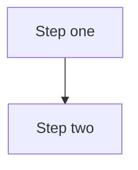

## Language & Runtime

| | Server | Client |
|-|--------|--------|
| Language | TypeScript 5.8.3 | TypeScript 5.9.2 |
| Framework | TsED 7.55.0 (Express) | Angular 20.2.1 |
| Target | ES2021, NodeNext (ESM) | ES2022, ESNext |
| Strict mode | `false` | `false` |
| Runtime | Node.js 20 | Browser |

Server compiler flags: `experimentalDecorators`, `emitDecoratorMetadata`, `verbatimModuleSyntax`, `sourceMap` — all `true`.

---

## Package Structure

Three independent npm packages, no root `package.json`:

```
server/    Node.js backend
client/    Angular frontend
shared/    TypeScript types only — no build step, imported via @shared/* alias
```

Cross-package rule: use `@shared/*` alias only. Never import between `server/` and `client/`.

```typescript
import type { Datasource } from '@shared/datasource.js'  // correct
import { something } from '../../client/src/...'          // never
```

---

## Linter & Formatter

| Tool | Version | Scope |
|------|---------|-------|
| ESLint | 8.34.0 | server |
| ESLint | 8.56.0 | client |
| Prettier | 3.8.1 | client only |

---

## Naming Conventions

### Files

| Construct | Pattern | Examples |
|-----------|---------|---------|
| Importer | `<type>.importer.ts` | `ckan.importer.ts` |
| Mapper | `<type>.mapper.ts` | `diplanung.csw.mapper.ts` |
| Settings | `<type>.settings.ts` | `csw.settings.ts` |
| Utility | `<name>.utils.ts` | `http-request.utils.ts` |
| Queries | `<store>.queries.ts` | `postgres.queries.ts` |
| Controller | `PascalCaseCtrl.ts` | `HarvesterCtrl.ts` |
| Service (server) | `PascalCase.ts` | `ConfigService.ts` |
| Service (client) | `PascalCase.service.ts` | `HarvesterService.service.ts` |
| Model / type | `kebab-case.ts` | `index.document.ts` |
| Factory | `<name>.factory.ts` | `catalog.factory.ts` |

### Code Symbols

| Construct | Convention | Example |
|-----------|-----------|---------|
| Classes | PascalCase | `CkanImporter` |
| Interfaces / types | PascalCase | `ImporterSettings` |
| Methods / functions | camelCase | `deleteRecordsForDatasource()` |
| Private methods | camelCase (no prefix) | `buildDeleteBySourceTransaction()` |
| Constants | UPPER_SNAKE_CASE | `MAX_RETRY_COUNT` |

---

## File Layout (server)

```
server/app/
  controllers/    HTTP endpoints (@Controller)
  services/       Business logic singletons (@Service)
  importer/       Base classes + one subfolder per importer type
  catalog/        Base class + one subfolder per catalog type
  profiles/       One subfolder per profile (ingrid, diplanung, lvr)
  persistence/    DatabaseFactory, ElasticsearchFactory, query files
  model/          Interfaces and types (no behaviour)
  utils/          Stateless helpers
  middlewares/    Express middleware
  sockets/        WebSocket services
```

---

## Import Style

- Relative imports within the same directory; `@shared/*` for cross-package.
- Always include `.js` extension (ESM/NodeNext requirement).
- Prefer named exports; default exports only when required by a framework.

```typescript
import { CkanMapper } from './ckan.mapper.js'
import type { Datasource } from '@shared/datasource.js'
import log4js from 'log4js'
```

---

## Error Handling

- `try/catch` everywhere; never swallow silently.
- Accumulate non-fatal errors in `Summary` as `TypedError { type: string, error: string }`.
- Log at ERROR before pushing to summary.
- `Importer.exec()` rolls back the database transaction on any unhandled error.
- No custom exception classes — use standard `Error`.

---

## Logging

Library: log4js 6.9.1 · one logger per file:
```typescript
const log = log4js.getLogger(import.meta.filename)
```

| Level | When |
|-------|------|
| `trace` | Internal state, rarely enabled |
| `debug` | Development diagnostics |
| `info` | Normal events (counts, completion) |
| `warn` | Degraded state, recoverable issues |
| `error` | Operation failed |
| `fatal` | Process-level failure |

Credentials must never appear in logs at any level.

---

## XML / External Format Conventions

- Library: `@xmldom/xmldom` DOM API — `createElementNS`, `appendChild`, `textContent`.
- Namespace URIs: always use constants from `server/app/importer/namespaces.ts`; never hardcode inline.
- Extract XML into dedicated private builder methods; never inline in orchestrating methods.

```typescript
// correct
const el = doc.createElementNS(namespaces.DCT, 'title')
el.textContent = this.getTitle()
parent.appendChild(el)

// wrong
const xml = `<dct:title>${this.getTitle()}</dct:title>`
```

---

## Diagrams

Use **Mermaid** for all diagrams in spec and context documents. Do not use ASCII art.

````markdown

````

Supported diagram types: `flowchart`, `sequenceDiagram`, `classDiagram`, `erDiagram`. Mermaid renders natively on GitHub, GitLab, and Obsidian.

---

## Async Patterns

- `async/await` is the default.
- `Observable<ImportLogMessage>` (RxJS) streams harvest progress to WebSocket clients — do not flatten to a Promise.
- Bucket streaming: `for await (const bucket of this.database.streamBuckets(...))`.
- No callbacks; no `.then()` chains where async/await is possible.

---

## Testing

| | |
|-|-|
| Framework | Mocha 10 + chai + sinon |
| Test location | `server/test/**/*.spec.ts` |
| Run | `npm run test` (profile: `mcloud`) |
| Client | Karma/Jasmine |
| E2E | Cypress 13 (`client/cypress/e2e/**/*.spec.ts`) |

Stub collaborators with sinon. Do not mock the database for integration-level tests.

**Catalog tests** — the `Catalog` base constructor calls `DatabaseFactory.getDatabaseUtils()`, which internally calls `ProfileFactoryLoader.get()`. Both must be stubbed in `before()` before instantiating any `Catalog` subclass:
```typescript
sinon.stub(DatabaseFactory, 'getDatabaseUtils').returns({} as any);
sinon.stub(ProfileFactoryLoader, 'get').returns({} as any);
```

**Stubbing HTTP calls in Catalog tests** — stub `RequestDelegate.doRequest` (static method) to control HTTP responses. Do not stub private methods such as `postTransaction` on catalog instances; this is fragile.

**Asserting on log output** — `log4js.getLogger()` returns a **new** `Logger` instance on every call. Sinon spying on the result of `getLogger` wraps a different object than the `const log` captured at module load time, so calls are not intercepted. Use a log4js inline appender instead:
```typescript
const events: Array<{ level: string; message: string }> = [];
log4js.configure({
    appenders: {
        capture: {
            type: { configure: () => (event: any) => events.push({ level: event.level.levelStr, message: String(event.data[0]) }) },
        },
    },
    categories: { default: { appenders: ['capture'], level: 'all' } },
});
```
Clear `events` in `beforeEach` and assert on it after each call.

---

## Build Tooling

| Step | Tool |
|------|------|
| Production build | `tsc` → `build/` |
| Dev server | nodemon + SWC (`@swc-node/register`) |
| Asset copy | `copyfiles` (JSON, SQL, XML, RDF → `build/`) |
| Client | `ng build` / `ng build --configuration production` |
