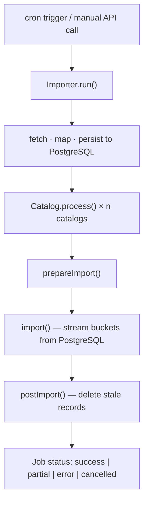

## Overview

InGrid Harvester pulls metadata from heterogeneous sources (CSW, WFS, CKAN, JSON, SPARQL, OAI, DCAT-AP.DE, DCAT-AP.PLU, KLD, GENESIS), normalises records into a uniform format, persists to PostgreSQL, and publishes to target catalogs (Elasticsearch, CSW, Piveau). Profile factories (ingrid, diplanung, lvr) tailor behaviour per deployment domain.

---

## Ubiquitous Language

| Term | Definition | Aliases |
|------|-----------|---------|
| Datasource | Configured external source; identified by numeric `id` and `type` (CSW, WFS, CKAN, …) | Harvester, Importer |
| Catalog | Target publish system; identified by numeric `id` and `type` (elasticsearch, csw, piveau) | |
| Record | Metadata entry in PostgreSQL; identity: `(identifier, source)` | RecordEntity |
| Index Document | Elasticsearch-formatted Record (`IndexDocument`) | Dataset |
| Harvest Run | One scheduled or manual pipeline execution for a datasource | Job |
| Job | Runtime tracking object: status, timing, document counts, stage details | |
| Profile | Factory configuring harvesting behaviour for a domain; determines importer types and compatible catalog types | Profile factory |
| Importer | Fetches raw data from a Datasource, produces normalised Records | |
| Mapper | Transforms source-specific data into `IndexDocument` format | |
| Traceability | Keywords on CSW records: `source:`, `catalog:`, `transaction:` — identify origin datasource, catalog instance, harvest run | Traceability keywords |
| Stale record | Catalog record not touched in the current harvest run; candidate for `postImport()` deletion | |
| Collection | Optional grouping entity in PostgreSQL; a Record references it via `collection_id` | |
| Coupling | Link between a dataset and a service; identity: `(dataset_identifier, service_id, service_type)` | |
| Summary | Mutable object accumulating metrics (counts, errors, warnings) over a Harvest Run | |
| Dry run | Harvest that validates records without writing to the target catalog | |
| Incremental harvest | Harvest processing only records changed since the last run | |

---

## Core Entities

**Datasource** — `shared/datasource.ts`, `server/app/importer/importer.settings.ts`
- Identity: numeric `id`
- Type: `CKAN | CSW | DCATAPDE | DCATAPPLU | GENESIS | JSON | KLD | OAI | SPARQL | WFS | WFS.FIS | WFS.MS | WFS.XPLAN | WFS.XPLAN.SYN`
- `catalogIds: number[]` — must have at least one entry
- Schedule: `cron.full` + `cron.incr`; flags: `disable`, `dryRun`, `blacklistedIds`, `whitelistedIds`

**Catalog** — `server/app/catalog/catalog.factory.ts`, `shared/catalog.ts`
- Identity: numeric `id`, `name`, `type`, `url`
- Lifecycle per harvest: `prepareImport() → import() → postImport()`
- Implementations: `ElasticsearchCatalog`, `CswCatalog`, `PiveauCatalog`

**Record** — `server/app/model/entity.ts`, PostgreSQL `record` table
- Identity: `(identifier, source)` — UNIQUE constraint
- Fields: `catalog_ids: number[]`, `dataset: IndexDocument` (JSONB), `dataset_csw`, `dataset_dcatapde`, `original_document`
- Timestamps: `created_on`, `last_modified`, `deleted_on` (soft delete)

**IndexDocument** — `server/app/model/index.document.ts`
- Identity: `uuid`
- `extras.metadata`: `harvested`, `modified`, `source`, `errors`, `is_valid`, `is_changed`

**Collection** — PostgreSQL `collection` table
- Optional record grouping; `properties` (JSONB), `dcat_ap_plu`, `json`

**Coupling** — PostgreSQL `coupling` table
- Identity: `(dataset_identifier, service_id, service_type)`; `distribution` (JSONB)

**Job** — `shared/job.ts`
- `jobId`, `harvesterId`, `startTime`, `finishTime`, `duration`
- `status: 'success' | 'error' | 'cancelled' | 'partial'`
- `stages: JobStage[]` with `TypedError { type, error }`

---

## Domain Rules

- Record identity is `(identifier, source)` — same identifier from two sources = two distinct records.
- A record may publish to multiple catalogs; each publish is independent.
- CSW records must carry traceability keywords: `source:${datasourceId}`, `catalog:${catalogId}`, `transaction:${timestamp}`.
- CSW deletion must filter on both `source:` AND `catalog:` — `source:` alone deletes records of other catalog instances on the same endpoint.
- Stale deletion in `postImport()` must not affect records from other datasources or catalog instances.
- A dry run must not mutate catalog state; PostgreSQL writes for validation are allowed.

---

## Harvest Run Lifecycle

---

## Profiles

| Profile | Domain | Supported importer types |
|---------|--------|--------------------------|
| `ingrid` | General geospatial metadata | CSW, DCATAPDE, GENESIS, WFS, WFS.FIS, WFS.MS, WFS.XPLAN, WFS.XPLAN.SYN |
| `diplanung` | Urban/regional land-use planning | CSW, DCATAPPLU, WFS.FIS, WFS.MS, WFS.XPLAN, WFS.XPLAN.SYN |
| `lvr` | LVR-specific | see `server/app/profiles/lvr/profile.factory.ts` |

Each profile provides: `getImporter()`, `getDocumentFactory()`, `getCatalog()`, `getProfileName()`, capability flags (`isIncrementalSupported`, `supportedCatalogTypes`).
