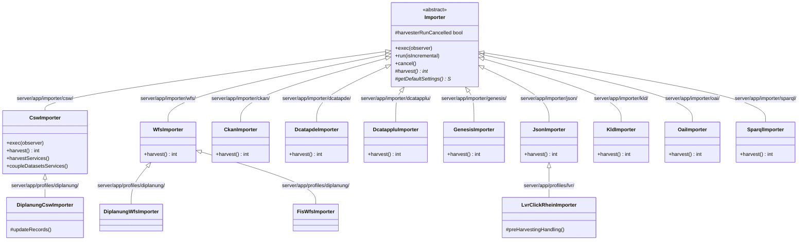
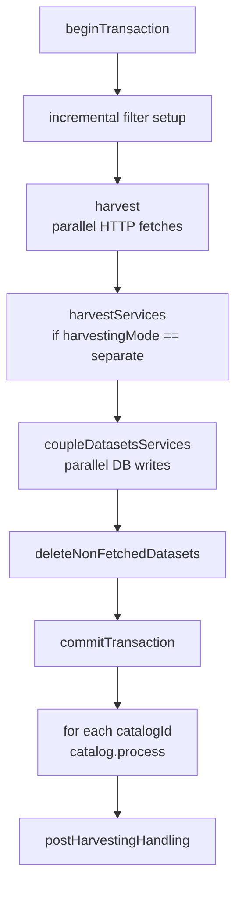
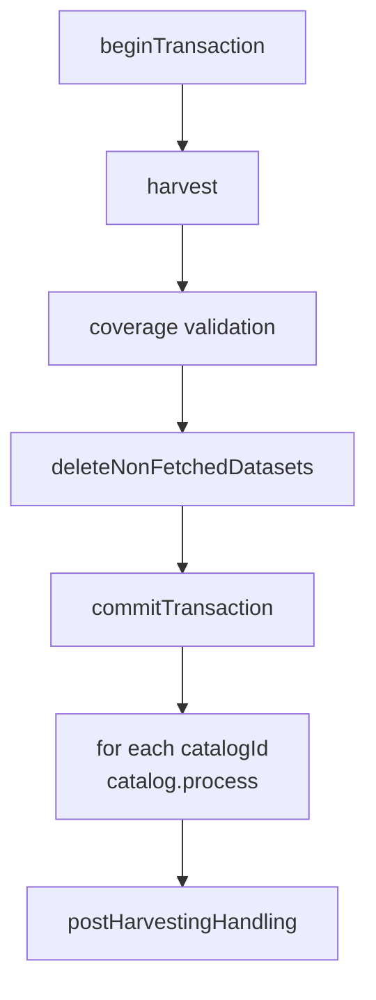
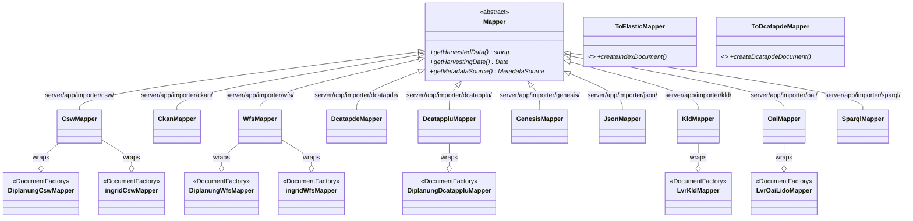

## Importer Hierarchy

---

## Critical exec() Invariant

- `CswImporter` is the **only** Level-2 importer that **replaces** `exec()` without calling `super.exec()`; adds `harvestServices()` and `coupleDatasetsServices()` before the catalog loop.
- All other Level-2 importers that override `exec()` call `super.exec(observer)`.
- `GenesisImporter` only overrides `harvest()`, not `exec()`.
- Level-3 importers do **not** override `exec()`; they override hooks (`updateRecords`, `postHarvestingHandling`, `getMapper`) or constructor logic.

### CswImporter exec() stages

### Base Importer exec() stages

---

## Where to Put Cross-Cutting Behavior

| Scope | Where to change |
|-------|----------------|
| All importers | `Importer.exec()` base class — covers all Level-2 and Level-3 importers except `CswImporter` |
| All CSW-type importers (including profile variants) | `CswImporter.exec()` — covers `CswImporter` and `DiplanungCswImporter` (which inherits exec()) |
| Profile-specific behavior | Level-3 importer — override a hook (`updateRecords`, `postHarvestingHandling`) |
| **Never** | Modify every Level-2 importer file individually for a cross-cutting concern |

---

## Mapper Hierarchy

Level-3 mappers implement `DocumentFactory<TargetDoc>` and **wrap** a Level-2 mapper instance rather than extending it. They are instantiated by the profile factory's `getDocumentFactory(mapper)`.
