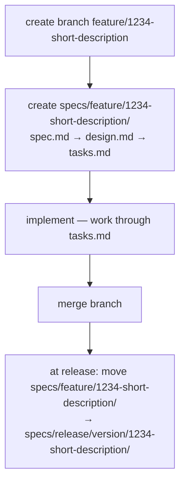

## Purpose

Defines spec-driven development for this project. Applies to humans and AI agents equally.

---

## Repository Layout

```
specs/
  context/          cross-cutting context — read before any feature work
  feature/          active/in-progress features (name = git branch name)
    <ticket>-<short-description>/    e.g. 1234-csw-delete-records-for-datasource
      spec.md       requirements
      design.md     architecture, decisions
      tasks.md      implementation checklist
  release/          completed features by release version
    <version>/
      <name>/
```

---

## Feature Lifecycle



`specs/feature/` = in progress · `specs/release/<version>/` = shipped

---

## Before Starting Any Feature Work

1. Read all files in `specs/context/`.
2. Read `spec.md`, `design.md`, `tasks.md` in `specs/feature/<ticket>-<short-description>/`.
3. If no spec exists, create one before writing code.

---

## Feature Spec Structure

### `spec.md`

```yaml
---
feature: <kebab-case-name>
status: draft | stable | deprecated
created: YYYY-MM-DD
---
```

Sections: Overview · Functional Requirements (FR-NNN) · Non-Functional Requirements (NFR-NNN) · Out of Scope.

### `design.md`

Frontmatter: + `spec: ./spec.md`

Sections: Architecture (Mermaid diagram) · Data Model · API / Interface · Key Decisions (decision | rationale | alternatives).

> **Diagrams:** Use Mermaid only. ASCII art diagrams are not allowed anywhere in `specs/`.

### `tasks.md`

Frontmatter: + `spec: ./spec.md`, `design: ./design.md`

```markdown
- [ ] TASK-NNN: Short title
  - Refs: FR-NNN
  - File: path/to/file.ts
  - Details: what to implement
  - Acceptance: how to verify
```

---

## Creating a New Feature Spec

1. `specs/feature/<ticket>-<short-description>/` — must match the git branch name exactly (`feature/1234-short-description`).
2. `spec.md` first — requirements drive design.
3. `design.md` once requirements are stable.
4. `tasks.md` once design is approved.
5. Implement only then.

---

## Rules for Modifying Code

**During implementation**
- Work through `tasks.md` top to bottom; mark `[x]` immediately when done.
- No task = no code. Add the task first if scope expands.

**After each task**
1. `tasks.md` — checkbox ticked?
2. `spec.md` — did the implementation deviate? Update or add a note.
3. `design.md` — did the design change (call graph, new helper, data model)? Update.
4. `specs/context/` — did the change affect any context document?
   - New anti-pattern → `anti-patterns.md`
   - New convention → `conventions.md`
   - Boundary changed → `architecture.md`
   - New domain term/rule → `domain.md`

---

## Rules for Modifying Specs

- A spec change affecting implemented code requires a corresponding code change (or an explicit out-of-sync note).
- `status: stable` documents: prefer adding entries over editing existing ones; always provide a reason.
- Never delete a requirement — mark `~~strikethrough~~` with a note.

---

## Release Checklist

For every feature shipped in this release:
- [ ] All `tasks.md` checkboxes are `[x]`
- [ ] Move `specs/feature/<ticket>-<short-description>/` → `specs/release/<version>/<ticket>-<short-description>/`

Incomplete features stay in `specs/feature/` and move at the release they finish in.

---

## Context Document Ownership

| File | Update when |
|------|-------------|
| `architecture.md` | Module boundaries change, new external integration added |
| `domain.md` | New entity, domain rule, or term enters the codebase |
| `conventions.md` | New convention established or existing one changed |
| `security.md` | New attack surface identified, auth pattern changed |
| `anti-patterns.md` | Bad pattern discovered and rejected |
