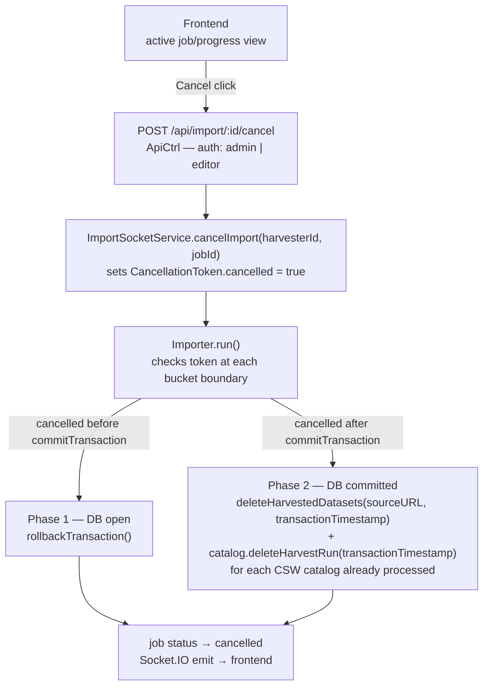

# Design: Cancel Harvester Run

## Architecture



**`commitTransaction()` remains before the catalog loop** (existing position, ~line 125 of `importer.ts`). This preserves the invariant that PostgreSQL records survive Phase 2 catalog errors. Cancellation is handled by deliberate cleanup code, not transaction rollback.

## Data Model

No schema changes. The `last_modified` column on the `record` table (set to `transactionTimestamp` during each harvest run) is used to identify and delete records belonging to the cancelled run in Phase 2.

CSW traceability keywords (injected by `addTraceability()`) already carry all three identifiers needed for safe cleanup:
- `transaction:${transactionTimestamp.toISOString()}` — identifies the specific run
- `source:${datasourceId}` — scopes deletion to the correct datasource
- `catalog:${catalogId}` — scopes deletion to the correct catalog instance

## API / Interface

### New endpoint

```
POST /api/import/:id/cancel
  Auth: AuthMiddleware + (admin | editor)
  Body: { jobId: string }
  Response 200: { cancelled: true }
  Response 404: { error: "no running harvest for id" }
```

### CancellationToken (new, in importer.ts or model/cancellation.ts)

```typescript
export interface CancellationToken {
    cancelled: boolean;
}

export class CancelledError extends Error {}
```

### ImportSocketService additions

```typescript
// Keyed by harvesterId
private activeJobs: Map<number, { token: CancellationToken; jobId: string }> = new Map();

cancelImport(harvesterId: number, jobId: string): boolean
// Sets token.cancelled = true; returns true if found, false if not running.
```

### PostgresUtils addition

```typescript
async deleteHarvestedDatasets(source: string, last_modified: Date): Promise<number>
// DELETE FROM record WHERE source = $1 AND last_modified = $2
// Returns count of deleted rows.
```

### CswCatalog addition

```typescript
async deleteHarvestRun(transactionTimestamp: Date): Promise<void>
// Issues CSW-T Delete with ogc:And of three PropertyIsLike filters (see XML below).
// Reuses buildTargetUrl(), postTransaction(), parseTransactionResponse().
// Logs totalDeleted at INFO; catches errors and logs at ERROR without rethrowing.

private buildDeleteByTransactionTransaction(transactionTimestamp: Date): string
// Returns CSW-T Transaction XML for the delete above.
```

**CSW-T XML template:**

```xml
<?xml version="1.0" encoding="UTF-8"?>
<csw:Transaction xmlns:csw="${namespaces.CSW}" xmlns:ogc="${namespaces.OGC}" service="CSW" version="2.0.2">
    <csw:Delete typeName="gmd:MD_Metadata">
        <csw:Constraint version="1.1.0">
            <ogc:Filter>
                <ogc:And>
                    <ogc:PropertyIsLike wildCard="%" singleChar="_" escapeChar="\\">
                        <ogc:PropertyName>dc:subject</ogc:PropertyName>
                        <ogc:Literal>%transaction:${transactionTimestamp.toISOString()}%</ogc:Literal>
                    </ogc:PropertyIsLike>
                    <ogc:PropertyIsLike wildCard="%" singleChar="_" escapeChar="\\">
                        <ogc:PropertyName>dc:subject</ogc:PropertyName>
                        <ogc:Literal>%source:${this.settings.id}%</ogc:Literal>
                    </ogc:PropertyIsLike>
                    <ogc:PropertyIsLike wildCard="%" singleChar="_" escapeChar="\\">
                        <ogc:PropertyName>dc:subject</ogc:PropertyName>
                        <ogc:Literal>%catalog:${this.settings.id}%</ogc:Literal>
                    </ogc:PropertyIsLike>
                </ogc:And>
            </ogc:Filter>
        </csw:Constraint>
    </csw:Delete>
</csw:Transaction>
```

## Key Decisions

| Decision | Rationale | Rejected Alternative |
|----------|-----------|----------------------|
| CancellationToken as plain `{ cancelled: boolean }` | Simple; checked synchronously at bucket boundaries; no extra dependency | AbortController/AbortSignal — overkill for a synchronous bucket loop |
| `POST /api/import/:id/cancel` | Clear intent; no collision with `DELETE /api/harvester/:id` | `DELETE /api/import/:id` |
| Keep `commitTransaction()` before catalog loop | Preserves the invariant that PostgreSQL is source of truth; catalog errors must not roll back DB records | Moving commit to after catalogs — would roll back DB on any catalog error (regression) |
| New `deleteHarvestedDatasets` for Phase 2 DB cleanup | Precisely removes only this run's records; previous-run records unaffected | `deleteRecordsForDatasource` at DB level — removes all records for the datasource, including previous runs |
| Three-way CSW filter (transaction + source + catalog) | Maximally safe; avoids collateral deletion across runs, datasources, and catalog instances | source + catalog only — would delete records from previous successful runs |
| Track already-processed catalogs during run | Call `deleteHarvestRun` only for catalogs already written to | Delete from all configured catalogs — over-deletes when cancel arrives before catalog loop starts |
| `CancelledError` separate from regular errors | Keeps cancel cleanup path strictly isolated from existing catalog-error handling (NFR-004) | Reusing existing error catch block — risks triggering cancel cleanup on unrelated catalog failures |
