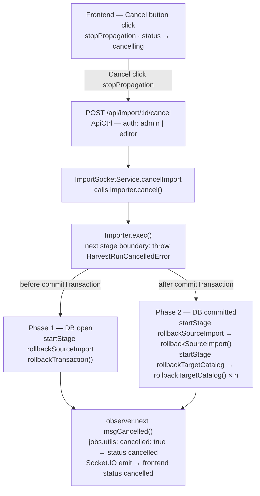
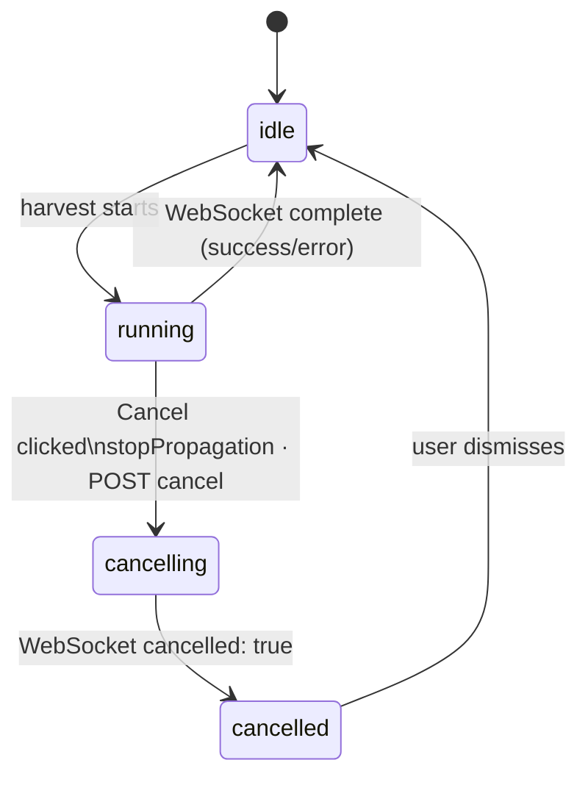

# Design: Cancel Harvester Run

## Architecture



**`commitTransaction()` remains before the catalog loop** (existing position). This preserves the invariant that PostgreSQL records survive Phase 2 catalog errors. Cancellation is handled by deliberate cleanup code, not transaction rollback.

**Stage-level cancellation**: `harvesterRunCancelled` is checked at stage boundaries (after `harvest()`, after `harvestServices()`, after `coupleDatasetsServices()`, before/between catalog iterations) — not inside parallel batch loops. This satisfies NFR-001 and avoids modifying every importer's internal loops.

**Two exec() files only**: `Importer.exec()` (base) covers all importers that call `super.exec()`; `CswImporter.exec()` is modified separately because it replaces exec() entirely. Level-3 importers (e.g. `DiplanungCswImporter`) inherit from their Level-2 parent and require no changes. See `specs/context/importers.md`.

## Data Model

No schema changes. The `last_modified` column on the `record` table (set to `transactionTimestamp` during each harvest run) is used to identify and delete records belonging to the cancelled run in Phase 2.

CSW traceability keywords (injected by `addTraceability()`) already carry all three identifiers needed for safe cleanup:
- `transaction:${transactionTimestamp.toISOString()}` — identifies the specific run
- `source:${datasourceId}` — scopes deletion to the correct datasource (`ImporterSettings.id`)
- `catalog:${catalogId}` — scopes deletion to the correct catalog instance (`CswCatalog.settings.id`)

## API / Interface

### New endpoint

```
POST /api/import/:id/cancel
  Auth: AuthMiddleware + (admin | editor)
  Body: { jobId: string }
  Response 200: { cancelled: true }
  Response 404: { error: "no running harvest for id" }
```

### `ImportLogMessage` change (`server/app/model/import.result.ts`)

Add `cancelled?: boolean` field. `Summary.msgCancelled()` (new method on `Summary`) returns `{ stage, complete: true, summary: this, cancelled: true }`. `jobs.utils.ts` `deriveStatus()` checks `logMessage.cancelled` instead of the fragile `message === 'Import cancelled'` string.

### Rollback stage tracking

In the `HarvestRunCancelledError` catch block, start named stages before each cleanup operation so rollback progress is visible in the WebSocket stream and job record:

```typescript
const s = this.startStage('rollbackSourceImport');
await this.database.rollbackTransaction();          // Phase 1
// or:
const count = await this.database.rollbackSourceImport(sourceURL, transactionTimestamp);  // Phase 2
observer.next(s.msgComplete(`Rolled back ${count} records`));

for (const catalog of processedCatalogs) {
    if (catalog instanceof CswCatalog) {
        const cs = this.startStage('rollbackTargetCatalog');
        await catalog.rollbackTargetCatalog(this.settings.id, transactionTimestamp);
        observer.next(cs.msgComplete());
    }
}
observer.next(this.summary.msgCancelled());
```

### `HarvestRunCancelledError` (new, in `server/app/importer/importer.ts`)

```typescript
export class HarvestRunCancelledError extends Error {}
```

Justified deviation from the "no custom exception classes" convention — required by NFR-004 for `instanceof` catch discrimination.

### `Importer` additions

```typescript
protected harvesterRunCancelled: boolean = false;

public cancel(): void {
    this.harvesterRunCancelled = true;
}
```

Stage-boundary check: `if (this.harvesterRunCancelled) throw new HarvestRunCancelledError();`

Scaffolding declared before try block:
```typescript
let transactionCommitted = false;   // set true after commitTransaction()
const processedCatalogs: Catalog[]; // push after each catalog.process()
```

Catch: single block with `instanceof` — `if (err instanceof HarvestRunCancelledError) { … } else { /* existing */ }`

### `ImportSocketService` additions

```typescript
private activeJobs: Map<number, { importer: Importer<any>; jobId: string }> = new Map();
cancelImport(harvesterId: number, jobId: string): boolean  // calls importer.cancel(); true if found
```

### `DatabaseUtils` addition (abstract method)

```typescript
abstract rollbackSourceImport(source: string, transactionTimestamp: Date): Promise<number>
// DELETE FROM record WHERE source=$1 AND last_modified=$2; returns deleted count
```
Implemented in `server/app/persistence/postgres.utils.ts`.

### `CswCatalog` addition

```typescript
async rollbackTargetCatalog(datasourceId: number, transactionTimestamp: Date): Promise<void>
// Issues CSW-T Delete with ogc:And of three PropertyIsLike filters (see XML below).
// Reuses buildTargetUrl(), postTransaction(), parseTransactionResponse().
// Logs totalDeleted at INFO; catches errors and logs at ERROR without rethrowing.

private buildRollbackTargetCatalogTransaction(datasourceId: number, transactionTimestamp: Date): string
// Returns CSW-T Transaction XML for the delete above.
```

**CSW-T XML template:**

```xml
<?xml version="1.0" encoding="UTF-8"?>
<csw:Transaction xmlns:csw="${namespaces.CSW}" xmlns:ogc="${namespaces.OGC}" service="CSW" version="2.0.2">
    <csw:Delete typeName="gmd:MD_Metadata">
        <csw:Constraint version="1.1.0">
            <ogc:Filter>
                <ogc:And>
                    <ogc:PropertyIsLike wildCard="%" singleChar="_" escapeChar="\\">
                        <ogc:PropertyName>dc:subject</ogc:PropertyName>
                        <ogc:Literal>%transaction:${transactionTimestamp.toISOString()}%</ogc:Literal>
                    </ogc:PropertyIsLike>
                    <ogc:PropertyIsLike wildCard="%" singleChar="_" escapeChar="\\">
                        <ogc:PropertyName>dc:subject</ogc:PropertyName>
                        <ogc:Literal>%source:${datasourceId}%</ogc:Literal>
                    </ogc:PropertyIsLike>
                    <ogc:PropertyIsLike wildCard="%" singleChar="_" escapeChar="\\">
                        <ogc:PropertyName>dc:subject</ogc:PropertyName>
                        <ogc:Literal>%catalog:${this.settings.id}%</ogc:Literal>
                    </ogc:PropertyIsLike>
                </ogc:And>
            </ogc:Filter>
        </csw:Constraint>
    </csw:Delete>
</csw:Transaction>
```

### Frontend cancel button state machine



The button element uses `(click)="onCancel($event)"` with `$event.stopPropagation()` to prevent the parent accordion from toggling. While in `cancelling` state the button label is "Cancelling…" and is disabled. The accordion must remain in its current open/closed state throughout.

## Key Decisions

| Decision | Rationale | Rejected Alternative |
|----------|-----------|----------------------|
| `harvesterRunCancelled: boolean` field on `Importer` | Simple; no indirection; service holds importer directly and calls `cancel()` | `CancellationToken` object — adds a reference hop with no benefit when the service stores the importer instance |
| Field on importer, not parameter on `run()` | No signature change to `run()`; no param threading through 8+ exec() overrides | Optional `token?` param on `run()` — every exec() override signature must be updated |
| `POST /api/import/:id/cancel` | Clear intent; no collision with `DELETE /api/harvester/:id` | `DELETE /api/import/:id` |
| Keep `commitTransaction()` before catalog loop | Preserves the invariant that PostgreSQL is source of truth; catalog errors must not roll back DB records | Moving commit to after catalogs — would roll back DB on any catalog error (regression) |
| `rollbackSourceImport` for Phase 2 DB cleanup | Precisely removes only this run's records; previous-run records unaffected | `deleteRecordsForDatasource` at DB level — removes all records for the datasource, including previous runs |
| Three-way CSW filter in `rollbackTargetCatalog` (transaction + source + catalog) | Maximally safe; avoids collateral deletion across runs, datasources, and catalog instances | source + catalog only — would delete records from previous successful runs |
| Track already-processed catalogs during run | Call `rollbackTargetCatalog` only for catalogs already written to | Delete from all configured catalogs — over-deletes when cancel arrives before catalog loop starts |
| `HarvestRunCancelledError` separate from regular errors | Keeps cancel cleanup path strictly isolated from existing error handling (NFR-004); `instanceof` check in single catch block | Reusing existing error catch block — risks triggering cancel cleanup on unrelated catalog failures |
| Stage-level cancellation checks (not mid-loop) | Avoids modifying all importer harvest loops; satisfies NFR-001 (not mid-bucket) | Per-batch check inside harvest/service loops — more responsive but requires touching all importers |
