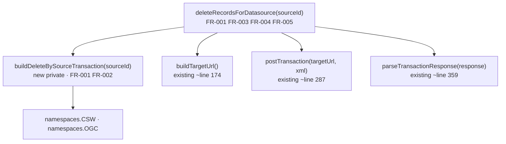

## Architecture

Change is fully contained within `CswCatalog` in `server/app/catalog/csw/csw.catalog.ts`.



## Data Model

Traceability keywords injected by `addTraceability()` (~line 247):

| Keyword | Purpose |
|---------|---------|
| `source:${datasourceId}` | Origin datasource |
| `catalog:${catalogId}` | Owning catalog instance |
| `transaction:${timestamp}` | Harvest run |

`deleteRecordsForDatasource` targets the intersection of the first two (FR-002).

## API / Interface

```typescript
// CswCatalog — csw.catalog.ts
async deleteRecordsForDatasource(sourceId: number): Promise<void>      // public
private buildDeleteBySourceTransaction(sourceId: number): string        // new
```

## Key Decisions

| Decision | Rationale | Rejected alternative |
|----------|-----------|---------------------|
| AND `source:` + `catalog:` filters | One CSW endpoint may serve multiple catalog instances; `source:` alone causes collateral deletion | `source:` filter only |
| Extract XML into `buildDeleteBySourceTransaction()` | Consistent with `buildFilteredDeleteTransaction()` pattern; keeps orchestrating method readable | Inline XML |
| Reuse `postTransaction()` / `parseTransactionResponse()` | Avoids duplicating HTTP, header, and error-detection logic | Direct HTTP call |

## XML Template

```xml
<?xml version="1.0" encoding="UTF-8"?>
<csw:Transaction xmlns:csw="${namespaces.CSW}" xmlns:ogc="${namespaces.OGC}" service="CSW" version="2.0.2">
    <csw:Delete typeName="gmd:MD_Metadata">
        <csw:Constraint version="1.1.0">
            <ogc:Filter>
                <ogc:And>
                    <ogc:PropertyIsLike wildCard="%" singleChar="_" escapeChar="\\">
                        <ogc:PropertyName>subject</ogc:PropertyName>
                        <ogc:Literal>%source:${sourceId}%</ogc:Literal>
                    </ogc:PropertyIsLike>
                    <ogc:PropertyIsLike wildCard="%" singleChar="_" escapeChar="\\">
                        <ogc:PropertyName>subject</ogc:PropertyName>
                        <ogc:Literal>%catalog:${this.settings.id}%</ogc:Literal>
                    </ogc:PropertyIsLike>
                </ogc:And>
            </ogc:Filter>
        </csw:Constraint>
    </csw:Delete>
</csw:Transaction>
```
