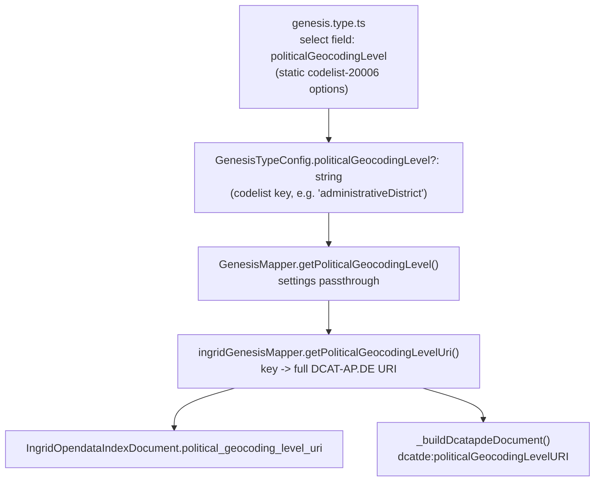

# Design: GENESIS politicalGeocodingLevel

## Architecture



`spatialUri` keeps its existing, separate path (`GenesisMapper.getSpatialUri()` → `ingridGenesisMapper._buildDcatapdeDocument()` → `dct:spatial`), untouched by this feature.

## Data Model

No persistence/schema change. New optional string field on `GenesisTypeConfig.typeConfig` (JSON config blob per datasource). New derived string on `IngridOpendataIndexDocument.political_geocoding_level_uri` (already existed, previously fed by the wrong source field).

## API / Interface

### `GenesisTypeConfig` (`server/app/importer/genesis/genesis.settings.ts`)
```typescript
politicalGeocodingLevel?: string;  // DCAT-AP.DE politicalGeocodingLevel codelist (20006) key, e.g. 'administrativeDistrict'
```

### `GenesisMapper` (`server/app/importer/genesis/genesis.mapper.ts`)
```typescript
getPoliticalGeocodingLevel(): string | undefined {
    return this.settings.typeConfig.politicalGeocodingLevel;
}
```

### `ingridGenesisMapper` (`server/app/profiles/ingrid/mapper/ingrid.genesis.mapper.ts`)
```typescript
const POLITICAL_GEOCODING_LEVEL_BASE = 'http://dcat-ap.de/def/politicalGeocoding/Level/';

private getPoliticalGeocodingLevelUri(): string | undefined {
    const key = this.baseMapper.getPoliticalGeocodingLevel();
    return key ? POLITICAL_GEOCODING_LEVEL_BASE + key : undefined;
}
```
- `createIndexDocument()`: `political_geocoding_level_uri: this.getPoliticalGeocodingLevelUri()` (was `this.baseMapper.getSpatialUri()`).
- `_buildDcatapdeDocument()`: appends `<dcatde:politicalGeocodingLevelURI rdf:resource="...">` after the existing `dct:spatial` block, reusing the already-declared `dcatde` namespace on `rdfRoot`.

### Frontend field (`client/src/app/datasources/dialog-edit/fields/types/genesis.type.ts`)
`type: "select"` (Material, via `withFormlyMaterial()`), static `props.options` array — same pattern as `wfs.type.ts`'s `httpMethod`/`pluPlanState` fields. No `labelProp`/`valueProp` needed (codebase always uses default `{ label, value }`).

## Key Decisions

| Decision | Rationale | Rejected Alternative |
|----------|-----------|----------------------|
| Add new field `politicalGeocodingLevel` instead of repurposing `spatialUri` | User decision after clarification: existing configs/behavior for `spatialUri` → `dct:spatial` must keep working unchanged | Renaming `spatialUri` to `politicalGeocodingLevel` (the originally requested approach) |
| URI built by simple string concatenation (`BASE + key`) | The 6 codelist keys are exactly the DCAT-AP.DE URI path segments (confirmed by existing `opendata-hro` DCATAPDE fixture) | A `Record<string,string>` lookup map (unnecessary indirection — see `getAccrualPeriodicityUri()` for where a map *is* needed, because German labels don't match URI segments) |
| Codelist values hardcoded as static frontend array | User decision: "erstmal als statisches Array" — no codelist XML/REST endpoint for this iteration | `codelist_20006.xml` + `Codelist.getInstance()` + new REST endpoint (bigger scope, no precedent for client-side codelist consumption) |
| `political_geocoding_level_uri` now sourced from the new field, not `spatialUri` | Fixes the semantic bug — this index field is documented DCAT-AP.DE vocabulary (`dcatde:politicalGeocodingLevelURI`), not a free-text spatial reference | Leaving it fed by `spatialUri` (perpetuates the bug) |
